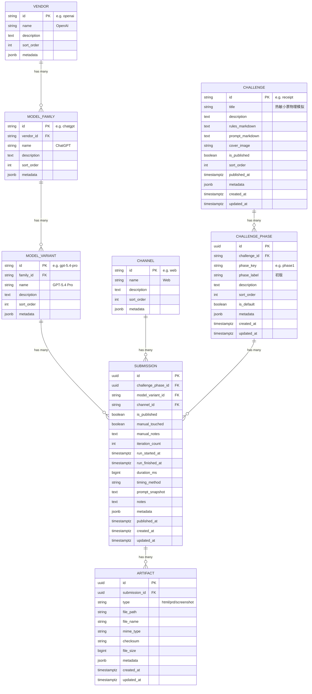

# VibeBench — PRD

> 同一道前端题，让不同 AI 来做，看看谁 vibe 得最好

## 1. 项目定位

VibeBench 是一个 **AI Vibe Coding 横评平台**。平台围绕同一道前端题（challenge）收集不同模型的产出，观众可以浏览、切换 phase、并排对比作品效果，并查看对应说明文档。

### 1.1 MVP 目标

- 把现有 `receipt` 单题展示，升级成可持续扩展的多赛题平台
- 让观众在 30 秒内进入任一赛题并开始对比不同模型结果
- 让管理员能在低操作成本下发布赛题、上传作品、控制公开状态
- 让每个公开作品具备最基本的可追溯性：模型、phase、prompt 版本、生成时间、是否人工修改

### 1.2 MVP 假设

- MVP 阶段只有 1 个管理员，不开放社区投稿
- 社区贡献通过开源仓库 PR 进入，由管理员审核后手动导入平台
- 公开站点只读，不做投票、评论、排行榜
- 首批重点是把对比体验和内容管理跑通，不追求复杂社交功能

**不是什么：**
- 不是跑分 benchmark，没有统一的客观评分体系
- 不是学术论文仓库，表达风格应轻松、好玩、可分享
- 不是单一赛题站点，`receipt` 只是第一个 challenge

**核心场景：**
1. 管理员发布新赛题（prompt + 规则说明 + phase 定义）
2. 管理员上传各模型的作品和说明文档
3. 观众按赛题或模型浏览内容，并发起 2 到 4 个模型的并排对比
4. 观众通过分享链接传播某个赛题或某次对比结果
5. 社区用户通过 GitHub PR 提交新的模型结果或修订建议，由管理员审阅后导入

---

## 2. 核心概念

### 2.1 内容对象

- **Vendor**：模型厂商，如 `OpenAI`、`Anthropic`
- **Model Family**：产品线或大类，如 `ChatGPT`、`Codex`
- **Model Variant**：具体模型版本，如 `gpt-5.4-pro`、`gpt-5.3-codex-high`
- **Channel**：调用渠道，如 `web`、`api`、`codex-app`
- **Challenge**：一道题，定义 prompt、规则说明、封面、展示顺序、公开状态、扩展元数据
- **Challenge Phase**：某个 challenge 自带的阶段配置，定义 `phase_key`、显示名、顺序、扩展元数据
- **Submission**：某个 `challenge phase + model variant + channel` 下的当前作品，是“展示单元”的最小单位
- **Artifact**：Submission 附属文件，如 HTML、PRD、截图等

### 2.2 展示与公平性规则

- 同一 challenge 下公开比较的 submission，必须共享同一套规则说明
- 若作品经过人工修订、补资源、重构目录，必须记录 `manual_touched` 和备注说明
- 允许展示人工修订后的 AI 结果，但前台必须有**明显标记**，并能查看修订说明
- 允许一个 submission 带多个 artifact，但只有带 `html` artifact 的 submission 才能进入实时对比页
- `prd` artifact 为可选，用于补充思路、限制条件或实现说明
- 为了可复现和减少安全风险，HTML 作品应尽量自包含，资源优先使用同目录相对路径，不依赖登录态、私有接口或第三方私有 CDN
- 平台不提供站内用户上传 HTML；所有对外可见内容都必须经过管理员审核和发布
- 每个公开 submission 应尽量附带客观元数据，至少包含渠道、是否人工修订；如能记录，额外展示耗时、迭代次数等背景信息，但不做评分和自动排名

### 2.3 元数据约定

- `challenges.metadata`：存放 challenge 级扩展信息，如外部参考链接、标签、来源说明、难度等级
- `submissions.metadata`：存放 submission 级扩展信息，如导入来源、补充运行参数、额外备注、成本信息
- `vendors.metadata`、`model_families.metadata`、`model_variants.metadata`、`channels.metadata`：预留用于存储厂商/模型的附加信息，如官网链接、logo、特性标签等
- `metadata` 只用于灵活扩展；会参与筛选、排序、联表的字段必须保留为显式列

### 2.4 数据关系



**两个核心浏览维度：**
- **按赛题浏览**："`receipt` 赛题下有哪些模型参加了？"
- **按模型浏览**："`GPT-5.4 Pro` 在不同渠道、不同赛题下效果如何？"

**MVP 发布开关：**
- `challenge.is_published`: 当前 challenge 是否公开展示
- `submission.is_published`: 当前 submission 是否公开展示

这样仍然支持“先上传、后公开” ，但状态建模先保持简单。

**关于 phase 默认项：**
每个 challenge 只能设置一个默认 phase（`is_default = true`），用于观众首次进入赛题详情页时默认展示的 phase。切换 phase 时 URL 应同步更新，确保分享链接能定位到具体 phase。

**关于 phase：**
- phase 不是平台级固定枚举，而是 challenge 自带配置
- `receipt` 当前使用 `phase1 / phase2`，只是这个 challenge 的临时约定
- MVP 通过 `challenge_phases` 表存 phase 的 key、显示名、顺序，不做更复杂的步骤编排系统

---

## 3. MVP 功能

### 3.0 开发优先级建议

**P0（必须先落地）：**
- 首页
- 赛题详情页
- 横评对比页
- Admin 登录
- 赛题 / 模型 / 作品后台管理

**P0+（P0 稳定后补齐）：**
- 模型目录与模型主页
- 缩略图预览
- 动态 Open Graph 图片

### 3.1 公开页面（不需登录）

#### 首页 `/`

- 平台介绍 + 最新已发布赛题列表
- 统计卡片：已发布赛题数、模型版本数、已发布 submission 数
- 赛题卡片网格（封面图 + 标题 + 已发布参赛模型数）
- 明确入口到最近更新的 challenge 或推荐对比

#### 赛题详情 `/challenges/:id`

- 赛题描述、规则说明、prompt 展示
- phase 切换（由 `challenge_phases` 决定；`receipt` 当前为 `phase1 / phase2`）
- 当前 phase 下所有已发布 submission 列表
- 每个 submission 展示基础元信息：模型版本、渠道、是否人工修改、更新时间
- 如有数据则展示客观背景元信息：耗时、迭代次数
- 若 `manual_touched = true`，卡片上显示明显的“人工修订”标记，并提供备注查看入口
- 点击模型卡片后，用 **sandboxed iframe** 查看 HTML 效果（详见 §5.2 安全策略）
- 若存在 `prd` artifact，则提供 PRD 文档弹窗或侧栏查看
- 若当前 phase 没有 HTML 作品，显示“该模型暂无可对比作品”

#### 模型主页 `/models/:id`

- 模型版本介绍（所属厂商、产品线、说明）
- 展示该模型版本参加的所有已发布赛题、phase 和渠道
- 每个赛题下展示最近一次已发布 submission 的缩略信息

#### 横评对比 `/compare`

- 选择一个赛题
- 选择 2 个参赛项进行 1v1 对比（`模型版本 x 渠道`）
- 选择 phase
- 并排 iframe 实时对比效果
- URL 参数设计：`/compare?challenge=receipt&phase=phase1&entries=gpt-5.4-pro@web,claude-sonnet-4@api`
- 布局策略：
  - 桌面端：左右 50/50 分栏
  - 移动端：纵向堆叠 + 标签切换，一次只渲染 1 个 iframe
- 对比页头部展示当前规则摘要，避免分享出去后别人不知道比较基准
- 若某个 submission 为人工修订版本，对应对比面板顶部显示显著标记
- 交互增强（可选）：同步滚动开关

#### 模型目录 `/models`

- 所有已注册模型版本的网格/列表
- 按厂商、产品线、渠道筛选
- 默认只展示至少有 1 个已发布 submission 的模型版本

### 3.2 Admin 后台（密码认证）

#### Admin 登录 `/admin/login`

- 简单密码认证，签发 JWT cookie（详见 §5.3 认证策略）
- 读取环境变量 `ADMIN_PASSWORD_HASH`

#### 赛题管理 `/admin/challenges`

- 创建 / 编辑 / 删除赛题
- 上传封面图
- 编辑规则说明和 prompt 内容（Markdown）
- 维护 challenge 级 metadata（JSON）
- 配置 challenge phases（key、显示名、顺序、默认项）
- 设置是否公开展示

#### 模型管理 `/admin/models`

- 创建 / 编辑 / 删除厂商、产品线、模型版本、渠道
- 维护层级关系、描述、排序和 metadata

#### 作品管理 `/admin/submissions`

- 选择赛题 x phase x 模型版本 x 渠道 创建 submission
- 录入作品元信息：`manual_touched`、`manual_notes`、`iteration_count`、`run_started_at`、`run_finished_at`、`duration_ms`、`timing_method`、`notes`、`metadata`
- 上传一个或多个 artifact：HTML、PRD、截图
- 同一 `challenge phase x model variant x channel` 在 MVP 中只保留 1 条当前 submission，新上传覆盖旧版本
- 查看上传状态矩阵（赛题 vs phase vs 模型版本 x 渠道，区分 `yes / no`）
- 删除 / 替换已有 artifact
- 支持 submission 级别的公开开关和预览

---

## 4. 未来功能（Phase 2+）

| 功能 | 说明 |
|------|------|
| 邮箱注册登录 | Supabase Auth |
| L 站 OAuth | linux.do 第三方登录 |
| 社区投票 | 赛题内模型排名由投票决定 |
| 评论区 | 每个 submission 下的讨论 |
| 多步骤赛题 | 在 challenge phases 之上增加更复杂的步骤编排能力 |
| 自动截图 | 为 HTML 作品自动生成预览图 |
| 对比集收藏 | 保存常用模型组合和分享链接 |
| 社区贡献工作流 | 用户提交 GitHub PR，管理员审核后导入站点 |

---

## 5. 技术方案

### 5.1 技术栈

| 层 | 选择 |
|---|---|
| 框架 | Next.js (App Router, TypeScript) |
| 数据库 | Supabase (PostgreSQL) |
| 文件存储 | MVP 使用 VPS 本地 `uploads/`；后续可迁移到 S3/R2 兼容对象存储 |
| 认证 (MVP) | 单管理员密码登录 + JWT cookie |
| 认证 (未来) | Supabase Auth (邮箱 + OAuth) |
| 部署 | PM2 + Cloudflare Tunnel |
| 域名 | Cloudflare 管理 |

### 5.2 安全策略

用户上传的 HTML 属于 **不受信任内容**，必须和主站尤其是 Admin 后台严格隔离。

- **独立沙箱域名**：公开 HTML 必须从独立 origin 提供，例如 `sandbox.vibebench.example.com`。不要在与主站 / 后台同源的域名下直接渲染上传 HTML。
- **文件不进入 `public/`**：所有 artifact 仍存放在 `uploads/` 中，由路由按需读取并输出。
- **iframe 沙箱默认从严**：默认使用 `sandbox="allow-scripts"`；如果作品必须依赖同源能力，则只能在独立沙箱 origin 下追加 `allow-same-origin`，绝不能与主站同源。
- **严格 CSP**：沙箱响应头默认限制为站内相对资源与必要的 `data:` / `blob:`，禁止表单提交、顶层跳转、弹窗、对主站 API 的访问。
- **上传校验**：校验扩展名、MIME、文件大小、路径穿越、重复文件；写入前生成 checksum。
- **Cookie 隔离**：Admin 登录 cookie 仅作用于主站域名，不发送到沙箱域名。

### 5.3 认证策略（MVP）

- JWT 过期时间：7 天
- 无 Refresh Token，过期后重新登录
- Cookie 属性：`httpOnly: true`、`secure: true`（生产环境）、`sameSite: 'strict'`
- 登录接口增加基础限流，避免公开后台密码被暴力尝试

### 5.4 性能策略

多个 iframe 同时渲染复杂前端 demo 有性能风险：

- 赛题详情页中的 iframe 懒加载，默认先展示卡片和元信息
- 对比页桌面端最多同时渲染 4 个 iframe；移动端一次只渲染 1 个
- 进入对比页前先校验所选 submission 是否存在 HTML artifact
- P0+ 可为每个 submission 生成静态截图，列表页优先展示截图

数据库层已针对常用查询场景创建索引：
- `submissions_phase_publish_idx`：支持按 phase 和发布状态筛选
- `submissions_variant_channel_idx`：支持按模型版本和渠道筛选
- `submissions_public_idx`：支持公开作品按发布时间排序
- `challenge_phases_challenge_sort_idx`：支持 challenge phases 排序查询

### 5.5 环境变量清单

| 变量名 | 说明 | 示例 |
|--------|------|------|
| `DATABASE_URL` | Supabase PostgreSQL 连接串 | `postgresql://...` |
| `ADMIN_PASSWORD_HASH` | Admin 登录密码哈希 | `bcrypt/argon2 hash` |
| `JWT_SECRET` | JWT 签名密钥 | 随机 32 字符以上 |
| `NEXT_PUBLIC_APP_URL` | 主站公开 URL | `https://vibebench.example.com` |
| `SANDBOX_BASE_URL` | 沙箱站点 URL | `https://sandbox.vibebench.example.com` |
| `UPLOAD_DIR` | 上传文件存放目录 | `./uploads` |
| `UPLOAD_MAX_FILE_SIZE_MB` | 上传大小限制 | `20` |

### 5.6 数据库 Schema

```sql
CREATE TABLE vendors (
  id text PRIMARY KEY,
  name text NOT NULL,
  description text,
  sort_order int NOT NULL DEFAULT 0,
  metadata jsonb NOT NULL DEFAULT '{}'::jsonb,
  created_at timestamptz DEFAULT now(),
  updated_at timestamptz DEFAULT now()
);

CREATE TABLE model_families (
  id text PRIMARY KEY,
  vendor_id text NOT NULL REFERENCES vendors(id) ON DELETE RESTRICT,
  name text NOT NULL,
  description text,
  sort_order int NOT NULL DEFAULT 0,
  metadata jsonb NOT NULL DEFAULT '{}'::jsonb,
  created_at timestamptz DEFAULT now(),
  updated_at timestamptz DEFAULT now()
);

CREATE TABLE model_variants (
  id text PRIMARY KEY,
  family_id text NOT NULL REFERENCES model_families(id) ON DELETE RESTRICT,
  name text NOT NULL,
  description text,
  sort_order int NOT NULL DEFAULT 0,
  metadata jsonb NOT NULL DEFAULT '{}'::jsonb,
  created_at timestamptz DEFAULT now(),
  updated_at timestamptz DEFAULT now()
);

CREATE TABLE channels (
  id text PRIMARY KEY,
  name text NOT NULL,
  description text,
  sort_order int NOT NULL DEFAULT 0,
  metadata jsonb NOT NULL DEFAULT '{}'::jsonb,
  created_at timestamptz DEFAULT now(),
  updated_at timestamptz DEFAULT now()
);

CREATE TABLE challenges (
  id text PRIMARY KEY,
  title text NOT NULL,
  description text,
  rules_markdown text,
  prompt_markdown text,
  cover_image text,
  is_published boolean NOT NULL DEFAULT false,
  sort_order int NOT NULL DEFAULT 0,
  metadata jsonb NOT NULL DEFAULT '{}'::jsonb,
  published_at timestamptz,
  created_at timestamptz DEFAULT now(),
  updated_at timestamptz DEFAULT now()
);

CREATE TABLE challenge_phases (
  id uuid PRIMARY KEY DEFAULT gen_random_uuid(),
  challenge_id text NOT NULL REFERENCES challenges(id) ON DELETE CASCADE,
  phase_key text NOT NULL,
  phase_label text NOT NULL,
  description text,
  sort_order int NOT NULL DEFAULT 0,
  is_default boolean NOT NULL DEFAULT false,
  metadata jsonb NOT NULL DEFAULT '{}'::jsonb,
  created_at timestamptz DEFAULT now(),
  updated_at timestamptz DEFAULT now(),
  UNIQUE(challenge_id, phase_key)
);

CREATE TABLE submissions (
  id uuid PRIMARY KEY DEFAULT gen_random_uuid(),
  challenge_phase_id uuid NOT NULL REFERENCES challenge_phases(id) ON DELETE CASCADE,
  model_variant_id text NOT NULL REFERENCES model_variants(id) ON DELETE RESTRICT,
  channel_id text NOT NULL REFERENCES channels(id) ON DELETE RESTRICT,
  is_published boolean NOT NULL DEFAULT false,
  manual_touched boolean NOT NULL DEFAULT false,
  manual_notes text,
  iteration_count int,
  run_started_at timestamptz,
  run_finished_at timestamptz,
  duration_ms bigint,
  timing_method text,
  prompt_snapshot text,
  notes text,
  metadata jsonb NOT NULL DEFAULT '{}'::jsonb,
  published_at timestamptz,
  created_at timestamptz DEFAULT now(),
  updated_at timestamptz DEFAULT now(),
  UNIQUE(challenge_phase_id, model_variant_id, channel_id)
);

CREATE TABLE submission_artifacts (
  id uuid PRIMARY KEY DEFAULT gen_random_uuid(),
  submission_id uuid NOT NULL REFERENCES submissions(id) ON DELETE CASCADE,
  type text NOT NULL,
  file_path text NOT NULL,
  file_name text NOT NULL,
  mime_type text,
  checksum text,
  file_size bigint,
  metadata jsonb NOT NULL DEFAULT '{}'::jsonb,
  created_at timestamptz DEFAULT now(),
  updated_at timestamptz DEFAULT now(),
  UNIQUE(submission_id, type)
);
```

> 建议把 `artifact type`、`timing_method` 等合法值同时放在应用层常量中统一校验；对于这类小范围固定值，数据库层也可加轻量 `CHECK` 兜底。MVP 不强依赖 enum，但接口层仍需要给出明确错误提示。
>
> 数据库层已实现的约束：
> - `timing_method` 合法值：`'manual'`, `'measured'`, `'estimated'`
> - `published_at` 仅在 `is_published = true` 时可设置
> - `run_finished_at` 必须大于等于 `run_started_at`
> - `iteration_count`、`duration_ms`、`file_size` 必须为非负数
> - 每个 challenge 只能有一个默认 phase

> `phase` 不应在平台层写死为 `phase1 | phase2`。推荐通过 `challenge_phases` 做 challenge 级白名单校验和排序。

> `published_at` 由应用层在“发布”动作发生时写入；`submission_artifacts` 的一条记录代表一个逻辑 artifact 的入口文件或主文件，不为 `html/assets/...` 下的每个静态文件单独建表。

### 5.7 文件存储结构

```text
uploads/
└── {challenge_id}/
    └── {model_variant_id}/
        └── {channel_id}/
            └── {phase_key}/  ← 从 challenge_phases.phase_key 获取
                ├── html/
                │   ├── index.html
                │   └── assets/...
                ├── prd/
                │   └── prd.md
                └── screenshot/
                    └── preview.png
```

这种结构能避免 `html` 和 `prd` 共用同一目录时的命名冲突，也能清楚区分“同一模型版本在不同渠道下”的结果。

### 5.8 API 路由

| 方法 | 路径 | 说明 | 认证 |
|------|------|------|------|
| **赛题** |||| 
| GET | `/api/challenges` | 已发布赛题列表；Admin 可加参数看全部状态 | 否 |
| POST | `/api/challenges` | 创建赛题 | Admin |
| GET | `/api/challenges/:id` | 赛题详情 + 已发布 submissions | 否 |
| PUT | `/api/challenges/:id` | 更新赛题 | Admin |
| DELETE | `/api/challenges/:id` | 删除赛题 | Admin |
| GET | `/api/challenges/:id/phases` | challenge phases 列表 | 否 |
| POST | `/api/challenges/:id/phases` | 创建 challenge phase | Admin |
| PUT | `/api/challenge-phases/:id` | 更新 challenge phase | Admin |
| DELETE | `/api/challenge-phases/:id` | 删除 challenge phase | Admin |
| **模型目录** |||| 
| GET | `/api/vendors` | 厂商列表 | 否 |
| GET | `/api/model-families` | 产品线列表 | 否 |
| GET | `/api/model-variants` | 模型版本列表；公开接口只返回至少有 1 个已发布 submission 的版本 | 否 |
| GET | `/api/channels` | 渠道列表 | 否 |
| POST | `/api/vendors` | 创建厂商 | Admin |
| PUT | `/api/vendors/:id` | 更新厂商 | Admin |
| DELETE | `/api/vendors/:id` | 删除厂商 | Admin |
| POST | `/api/model-families` | 创建产品线 | Admin |
| PUT | `/api/model-families/:id` | 更新产品线 | Admin |
| DELETE | `/api/model-families/:id` | 删除产品线 | Admin |
| POST | `/api/model-variants` | 创建模型版本 | Admin |
| PUT | `/api/model-variants/:id` | 更新模型版本 | Admin |
| DELETE | `/api/model-variants/:id` | 删除模型版本 | Admin |
| POST | `/api/channels` | 创建渠道 | Admin |
| PUT | `/api/channels/:id` | 更新渠道 | Admin |
| DELETE | `/api/channels/:id` | 删除渠道 | Admin |
| **作品** |||| 
| GET | `/api/submissions` | 作品列表；公开接口仅返回 `is_published = true`，Admin 可按 `challenge/phase/model_variant/channel` 筛选 | 否 |
| POST | `/api/submissions` | 创建 submission 并上传 artifact | Admin |
| PUT | `/api/submissions/:id` | 更新 submission 元信息或公开状态 | Admin |
| DELETE | `/api/submissions/:id` | 删除 submission 及其 artifact | Admin |
| POST | `/api/submissions/:id/artifacts` | 上传 / 替换 artifact | Admin |
| DELETE | `/api/submissions/:id/artifacts/:type` | 删除指定 artifact | Admin |
| **沙箱文件** |||| 
| GET | `/s/:submissionId/*` | 在沙箱域名下返回 HTML 及其相对资源 | 否 |
| **认证** |||| 
| POST | `/api/auth/login` | 密码登录 | 否 |
| POST | `/api/auth/logout` | 登出 | 否 |

> 数据库已创建 `submission_overview` 视图，聚合 submission 及其关联的 challenge、phase、vendor、family、variant、channel 信息，并包含 `has_html`、`has_prd`、`has_screenshot` 布尔字段。列表查询建议使用该视图以减少前端 JOIN 复杂度。

---

## 6. SEO 与社交分享

作为面向社区的展示平台，分享预览效果很重要：

- 每个页面设置清晰的 `<title>` 和 `<meta name="description">`
- 赛题详情页、模型主页、横评对比页生成动态 Open Graph 图片
- 只索引主站公开页面；沙箱域名上的作品页统一 `noindex`
- 对比链接的 OG 信息应包含赛题名、参赛项（模型版本 + 渠道）、phase，减少“点开前不知道比了什么”的问题

---

## 7. 数据迁移

现有 `receipt` 项目作为第一个 challenge 导入。编写一次性迁移脚本 `scripts/migrate-receipt.ts`：

1. 创建 `receipt` challenge，并写入 `prompt_markdown`、`rules_markdown`
2. 为 `receipt` 建立 `challenge_phases`
3. 创建 `vendor / family / variant / channel` 基础目录数据，并把旧模型映射到新层级
4. 扫描旧目录，把 HTML / PRD / 资源文件按新结构复制到 `uploads/receipt/{model_variant_id}/{channel_id}/{phase_key}/{type}/`
5. 为每个 `challenge phase x model variant x channel` 创建一条 `submission`
6. 为每个 artifact 建立 `submission_artifacts` 记录，并写入 `mime_type`、`file_size`、`checksum`
7. 如能补齐，则写入 `duration_ms`、`iteration_count` 等客观元数据；缺失时允许为空
8. 校验缺失项，输出迁移报告（哪些模型缺 HTML、哪些缺 PRD）
9. 迁移完成后保留原 `receipt` 项目文件作为备份，但后续运营数据以数据库 + `uploads/` 为准

---

## 8. 设计调性

- 轻松有趣，不做严肃跑分站的视觉语气
- 延续 `receipt` 项目的 Organic / Natural 美学风格
- 交互上要有节奏感，但信息层级优先于炫技
- 重点突出赛题、phase、模型、规则摘要和作品状态
- 响应式设计，确保桌面和移动端都能顺畅浏览和切换对比

---

## 9. 决策记录

### 9.1 已确认

1. **MVP 是否保留历史版本？**  
   已定：不保留。同一 `challenge phase + model variant + channel` 下只保留 1 条当前 submission。
2. **PRD artifact 是否为必填？**  
   已定：不是必填。进入 compare 的硬条件只有 HTML artifact。
3. **`phase1 / phase2` 是否平台固定命名？**  
   已定：不是。它只是 `receipt` 测试的临时约定，其他 challenge 可自定义 phase 标签。
4. **是否开放站内用户上传？**  
   已定：不开放。社区贡献通过 GitHub PR，由管理员审核后手动导入。
5. **模型和渠道是否拆表？**  
   已定：拆开。模型按 `vendor -> family -> variant` 建模，渠道单独建表，由 submission 关联。
6. **challenge 和 submission 是否支持扩展元数据？**  
   已定：支持。两者都保留 `metadata jsonb`，但关键筛选字段仍使用显式列。

### 9.2 仍待确认

当前无未决项。后续若新增 challenge 规则差异，再补充到本节。
